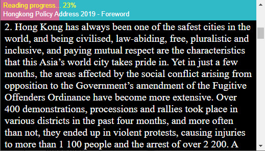

# YYBar - A Reading Progress Bar
 

## <u>Features</u>
###### 1. Show progress percentage when scrolling the page or DOM element.
###### 2. The width of progress bar will be updated if scrolling.
###### 3. Besides of `document.body`, the scrolling target can be set to any DOM element.
###### 4. Click the YYBar, the page(or DOM element) will scroll to the corresponding position.
###### 5. Support `mouseMove` gesture for desktop.
###### 6. Support `touchMove` gesture for mobile.
###### 7. It can be placed at the top or below of page.
###### 8. Support auto hide if scrolling up.
###### 9. You can customize all its color, text and height.
###### 10. Provide `dispose` method if need to detach YYBar from the page.
``` 
    const yybar = new Yybar("yybar")
    yybar.dispose();
```

## 
## <u>How to use</u>

#### Method 1: 
###### Using node.js package manager
``` 
    npm install --save yybar 
```
###### Create a HTML DOM element on your component
``` 
    <div id="yybar"></div>
```
###### import `yybar` into your component, then initialize it
``` 
    import Yybar from 'yybar'
    const yybar = new Yybar("yybar")
```
## 
#### Method 2: 
###### Directly import the minified file into your page
``` 
    <script type='module'>
        import Yybar from './yybar.min.js';
        const yybar = new Yybar("yybar");
    </script>
```
# 
## <u>Advanced use</u>
###### You can customize YYBar by adding params (all are optional) as the 2nd argument
```
    const yybar = new Yybar("yybar", {

        target:'content',                       // use document.body by default, but you can set other target DOM element 

        backBarColor: '#30B9C7',                // YYBar background color
        foreBarColor:'#CF6B96',                 // YYBar progress bar color

        progressText: 'Reading progress...',    // YYBar progress description
        progressTextColor: '#ffff00',           // YYBar progress description color

        desc: 'Any description text',           // YYBar description about the target content
        descColor: '#ffffff',                   // YYBar description color

        height: 40,                             // height
        position: 'top',                        // either set 'top' or 'bottom'
        autoHide: false,                        // true: Invisible if scrolling up, vice versa
                                                // false: Always visible
        
    });
```
